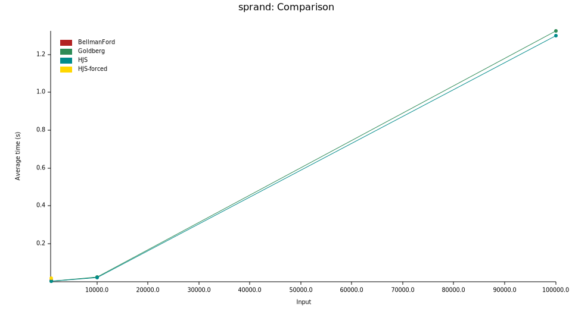
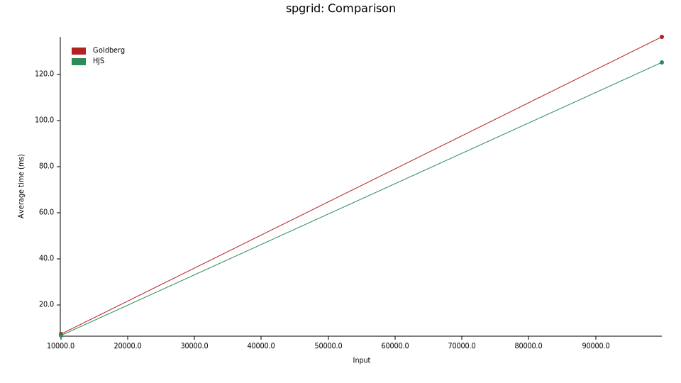
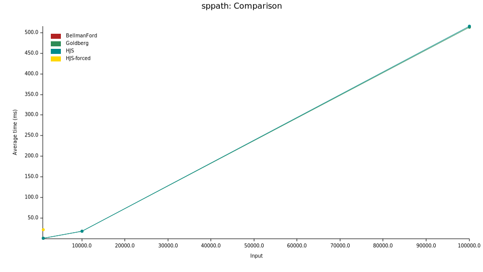

# HJS SSSP

A Rust implementation of the **Haeupler–Jiang–Saranurak (HJS) 2025** algorithm for
single-source shortest paths (SSSP) in directed graphs with negative integer weights,
together with Goldberg's practical bit-scaling algorithm, classical Bellman-Ford, and
Dijkstra as supporting subroutines.

**Paper:** _Near-Optimal Deterministic Single-Source Shortest Paths in Directed Graphs_,
Haeupler, Jiang, and Saranurak (2025).

---

## Algorithms

### `sssp` — HJS 2025 (Theorem 1.1)

```text
O(m log⁸ n · log(nW))
```

The main entry point for general-purpose SSSP with arbitrary integer weights. Applies the
BCF23 weight-scaling reduction (Lemma 5.2) to progressively reveal one bit of each weight
per phase, building a sequence of potential-adjusted graphs. Each phase is solved via
`restricted_sssp`, which drives the recursive `k_sssp` subroutine:

- **Base case** (`k ≤ log⁶ n` negative edges allowed): `sssp_few_negative` (Lemma 5.5)
  alternates Dijkstra passes with Bellman-Ford fix-up rounds.
- **Recursive case**: constructs a *d-path cover* of the non-negative sub-graph via
  `path_cover`, prunes to within-SCC edges (Lemma 5.4 premise), solves recursively
  with `k/2`, then assembles `G″` (x = 2λ tiered copies) and calls `sssp_cross_scc`.

Returns `None` if the graph contains a negative-weight cycle.

---

### `goldberg` — Goldberg's bit-scaling algorithm

```text
O(m √n log(nW))
```

Practical scaling algorithm that reveals one bit of each weight per phase, using
`sssp_minus_one` (the O(m√n) SSSP subroutine for weights in `{−1, 0, …, n}`) to repair
potentials within each phase. Competitive with HJS at benchmark sizes and simpler to reason
about. Returns `None` on a negative-weight cycle.

---

### `bellman_ford` — Bellman-Ford / Moore

```text
O(m n)
```

Runs n−1 relaxation rounds over all edges. Reliable baseline for small graphs or when
code simplicity matters. Returns `None` on a negative-weight cycle.

---

### `dijkstra` — Dijkstra with a binary heap

```text
O((m + n) log n)
```

Binary-heap Dijkstra with lazy deletion. **Requires all edge weights to be non-negative.**
Used internally as the fast solver once potentials have been computed; also the right choice
when you know your graph has no negative weights.

---

### `sssp_hjs_forced` — HJS with forced recursion

Variant of `sssp` that forces the full HJS recursive path-cover machinery to fire at every
level regardless of the negative-edge count. Useful for testing and profiling the recursive
case in isolation. In practice `sssp` is always faster because it falls back to
`sssp_few_negative` at small `k`.

---

## When to use which algorithm

| Situation | Recommended |
|-----------|-------------|
| All edge weights ≥ 0 | `dijkstra` |
| Tiny graph (n < ~50) or debugging | `bellman_ford` |
| General negative weights, practical use | `goldberg` or `sssp` |
| Need the best theoretical complexity | `sssp` (HJS) |
| Profiling / testing the recursive HJS case | `sssp_hjs_forced` |

In practice `sssp` and Goldberg perform almost identically across all benchmarked sizes
(up to n = 100 000). Both are vastly better than `bellman_ford` once the graph becomes
even slightly dense (m ≫ √n).

---

## Building

### Prerequisites

| Tool | Purpose | Install |
|------|---------|---------|
| [Rust](https://rustup.rs) ≥ 1.87 (edition 2024) | Compile the library | `curl --proto '=https' --tlsv1.2 -sSf https://sh.rustup.rs \| sh` |
| [uv](https://docs.astral.sh/uv/) | Python environment & task runner | `curl -LsSf https://astral.sh/uv/install.sh \| sh` |
| [maturin](https://www.maturin.rs) ≥ 1.0 | Build the PyO3 extension | installed automatically via `uv sync` |

### Rust library

```sh
# Run the full test suite (40 tests)
cargo test

# Build optimised (fat-LTO) benchmarks and run them
cargo bench

# Enable optional Rayon parallelism
cargo test --features parallel
cargo bench --features parallel

# Generate API documentation and open it
cargo doc --open
```

### Python extension (optional)

```sh
# Create the virtual environment and install dependencies (maturin, networkx)
uv sync --group dev

# Compile and install the extension into the venv (debug build, fast iteration)
uv run maturin develop --features python

# Run the Python test suite (24 tests across 3 algorithms)
uv run python -m unittest discover -s tests -v

# Build a release wheel for distribution
uv run maturin build --release --features python
# wheel ends up in target/wheels/
```

---

## Usage

Add to `Cargo.toml`:

```toml
[dependencies]
hjs-path-finding = { path = "." }
```

Enable optional Rayon parallelism:

```toml
[dependencies]
hjs-path-finding = { path = ".", features = ["parallel"] }
```

Basic example:

```rust,no_run
use hjs_sssp::graph::{Graph, NodeId};
use hjs_sssp::sssp::{sssp, INF};

// Build a small graph with a negative edge.
let mut g = Graph::with_capacity(4, 4);
g.add_nodes(4);
g.add_edge(NodeId(0), NodeId(1),  5);
g.add_edge(NodeId(1), NodeId(2), -3);
g.add_edge(NodeId(0), NodeId(2),  8);
g.add_edge(NodeId(2), NodeId(3),  2);

let dist = sssp(&g, NodeId(0)).expect("no negative cycle");

assert_eq!(dist[0],  0);   // source
assert_eq!(dist[1],  5);
assert_eq!(dist[2],  2);   // via 0→1→2: 5 + (−3) = 2
assert_eq!(dist[3],  4);   // via 0→1→2→3
```

---

## Parallelism

Enable with `--features parallel` (adds [Rayon](https://docs.rs/rayon) as a dependency).

Two adaptive thresholds gate the parallel paths:

| Threshold | Value | Guards |
|-----------|-------|--------|
| `PAR_BF_MIN_EDGES` | 4 096 edges | Bellman-Ford relaxation rounds |
| `PAR_GRAPH_MIN_EDGES` | 65 536 items | All graph-construction edge loops |

Below each threshold the code falls back to the serial path. On macOS, Rayon's thread-pool
wakeup costs roughly 50–100 µs per `into_par_iter()` call; below the thresholds this fixed
overhead would dominate the actual computation. At benchmark sizes (m ≤ 3 200) no parallel
path is taken, so `--features parallel` produces timing-identical output to serial builds.
The parallel paths become active for large graphs (m ≥ 65 536 edges, roughly n ≥ 10 000
for sparse inputs).

---

## Benchmarks

Measured on Apple M-series hardware with `[profile.bench] lto = "fat" codegen-units = 1`,
`sample_size(10)`, `measurement_time(5s)`. The interactive Criterion HTML report is
published on [GitHub Pages](../../criterion/report/index.html) and regenerated on demand
via the **Docs** workflow (`Run benchmarks` input).

Run locally with:

```sh
cargo bench                        # serial
cargo bench --features parallel    # with Rayon (thresholds apply, no difference at these sizes)
```

### Sparse random graph — 4n arcs, weights ∈ [−n, n]

| n | m | HJS | Goldberg | Bellman-Ford |
|---|---|-----|----------|--------------|
| 1 000 | 4 000 | 0.62 ms | 0.62 ms | 4.7 ms |
| 10 000 | 40 000 | 22 ms | 24 ms | — |
| 100 000 | 400 000 | **1.30 s** | **1.32 s** | — |



### Grid graph — r×c grid, weights ∈ [−n, n]

| n | rows×cols | HJS | Goldberg |
|---|-----------|-----|---------|
| 10 000 | 100×100 | 6.5 ms | 7.4 ms |
| 99 856 | 316×316 | **125 ms** | **136 ms** |



### Path graph — linear chain, weights ∈ [−n, n]

| n | HJS | Goldberg | Bellman-Ford |
|---|-----|----------|--------------|
| 1 000 | 0.73 ms | 0.75 ms | 3 µs |
| 10 000 | 18 ms | 18 ms | — |
| 100 000 | **515 ms** | **513 ms** | — |

Bellman-Ford's early-termination makes it orders of magnitude faster on path graphs;
Goldberg/HJS apply all scaling phases regardless of graph structure.



Bellman-Ford and `HJS-forced` are excluded above n = 2 000 (O(mn) and forced-recursion
overhead respectively make them impractical at large n).

---

## Why `sssp` and Goldberg perform identically

Both are potential-based bit-scaling algorithms with the same outer loop (log₂(W) + 1
phases, each building a potential-adjusted graph). The difference is in the inner SSSP
subroutine: Goldberg calls `sssp_minus_one` (a tight BF loop for weights in {−1,…,n});
HJS calls `k_sssp`, which falls back to the same alternating Dijkstra/BF logic whenever
k ≤ threshold (log² n in this implementation). For every n benchmarked, k ≪ threshold,
so the HJS recursive path-cover case never fires and both algorithms execute identical
work. The recursive branch only becomes beneficial at n ≫ 10⁶ where the O(√n) vs
O(log⁸ n) gap finally outweighs Goldberg's smaller constant factors.

---

## Python bindings (optional)

A [PyO3](https://pyo3.rs)-based Python extension is available via the `python` feature.
It accepts any object with a NetworkX-compatible `.nodes()` / `.edges(data=True)` interface.

### Build

```sh
pip install maturin
maturin develop --features python        # editable install into the active virtualenv
# or: maturin build --release --features python  # produces a wheel
```

### Usage

```python
import networkx as nx
import hjs_sssp

G = nx.DiGraph()
G.add_edge(0, 1, weight=5)
G.add_edge(1, 2, weight=-3)
G.add_edge(0, 2, weight=8)
G.add_edge(2, 3, weight=2)

# HJS 2025 — returns dict {node: distance} or None on negative cycle
dist = hjs_sssp.sssp(G, source=0)
# {0: 0, 1: 5, 2: 2, 3: 4}

# Goldberg's algorithm
dist = hjs_sssp.goldberg(G, source=0)

# Bellman-Ford
dist = hjs_sssp.bellman_ford(G, source=0)
```

All three functions share the same signature:

```python
hjs_sssp.sssp(digraph, source, *, weight="weight", default_weight=1)
```

- `digraph` — any object with `.nodes()` and `.edges(data=True)` (e.g. `nx.DiGraph`)
- `source` — source node (any hashable Python object)
- `weight` — edge attribute name to read as integer weight (default: `"weight"`)
- `default_weight` — fallback weight when the attribute is absent (default: `1`)

Returns `None` if the graph contains a negative-weight cycle; otherwise a `dict` mapping
each node to its shortest distance (`None` for unreachable nodes).

---

## Crate structure

| Module | Contents |
|--------|----------|
| `graph` | Arena-backed directed weighted graph (`Graph`, `NodeId`, `EdgeId`) |
| `sssp` | All SSSP algorithms (public API) |
| `path_cover` | d-path cover construction (Theorem 4.5) |
| `projection` | Projection / preimage data structures used by path cover |

---

## License

MIT OR Apache-2.0
